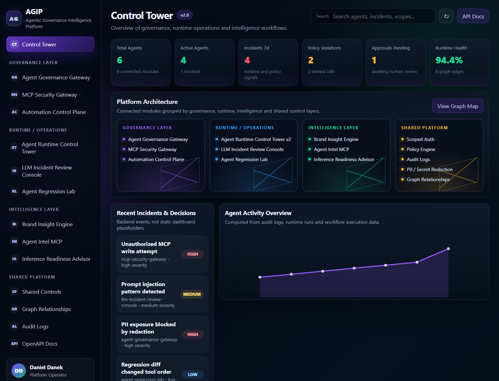
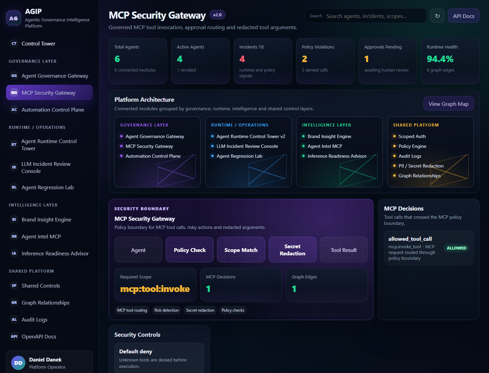
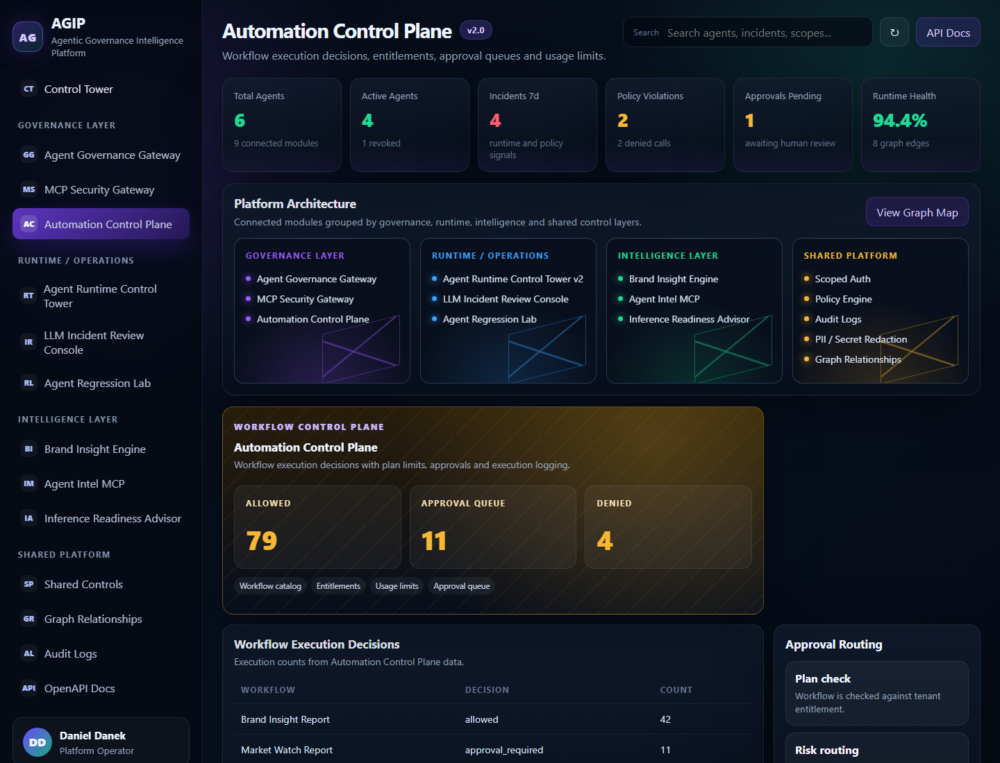
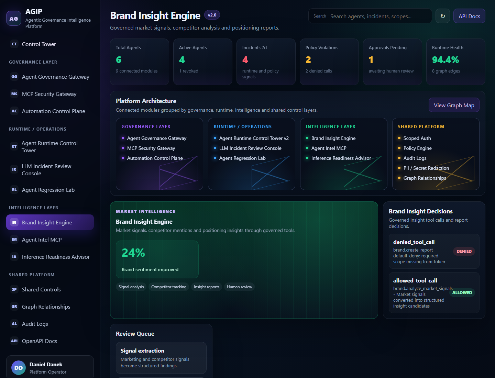
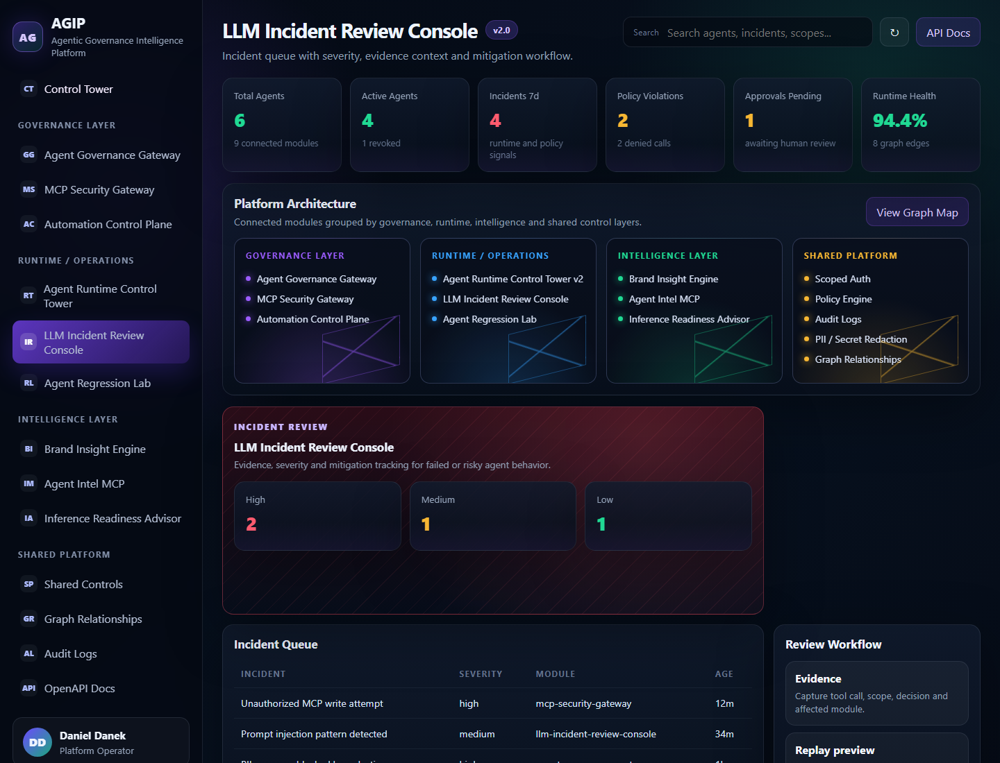
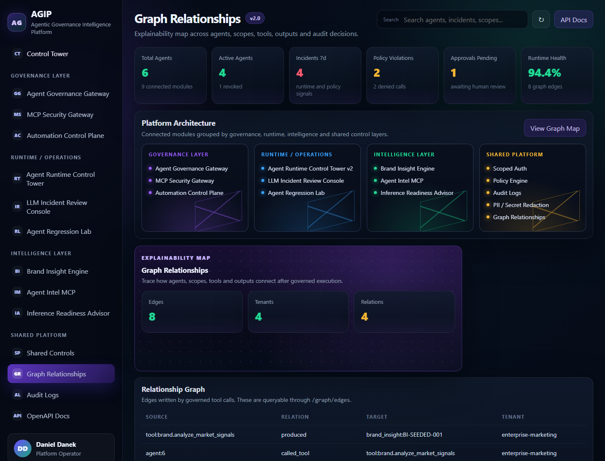
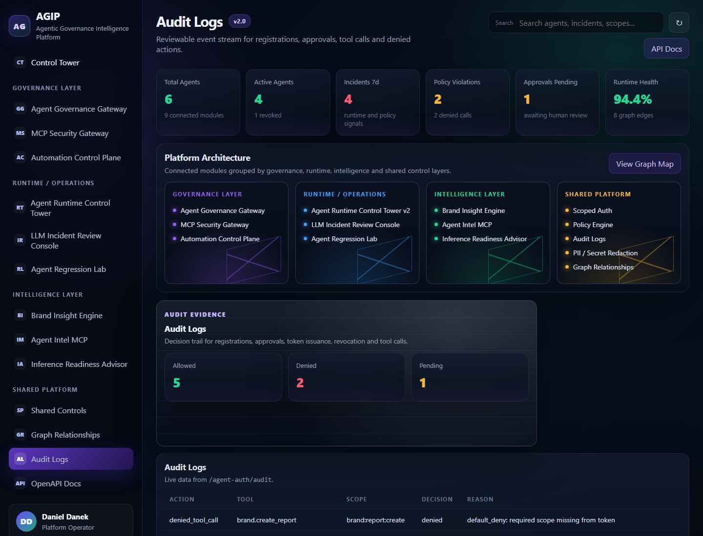

# Agentic Governance Intelligence Platform

[](https://fastapi.tiangolo.com/)
[](https://www.python.org/)
[](https://www.sqlalchemy.org/)
[](#product-thesis)
[](#platform-modules)
[](#auditability-and-graph-traceability)
[](.github/workflows/ci.yml)
[](LICENSE)

**AGIP is a local-first AI governance platform for autonomous agents. It provides scoped access, policy enforcement, human approvals, audit logs, redaction, incidents, regression checks and observability for AI agents before they interact with business or developer tools.**

Main positioning: **Govern, observe and secure autonomous AI agents before they touch business systems.**

This is **not a chatbot**. It is the governance, security and operations layer around AI agents that need to use business tools safely.



## Product Thesis

AI agents should not receive unrestricted API keys, direct database credentials or unreviewed access to sensitive business systems.

In a real organization, agents need a control plane that can answer:

- who owns this agent?
- which scopes were requested?
- which scopes were approved by a human?
- which tool did the agent try to call?
- was the action allowed, denied, revoked or routed to approval?
- what data was redacted?
- what audit evidence explains the decision?
- what graph relationship connects the agent, scope, tool and output?

AGIP models that control plane.

```text
AI Agent
  -> Registration
  -> Human approval
  -> Short-lived scoped token
  -> Tool gateway
  -> Policy engine
  -> PII / secret redaction
  -> Audit log
  -> Incident review
  -> Regression checks
  -> Observability
  -> Relationship graph
  -> Operator dashboard
```

## What This Demonstrates

This project is designed as a portfolio-grade backend and platform prototype. It demonstrates:

- FastAPI service design with clean module boundaries
- scoped JWT credentials for agents
- human approval and revocation flows
- policy-enforced tool access
- MCP-style tool gateway governance
- workflow control-plane decisions
- audit logging for allowed and denied actions
- PII and secret redaction
- graph-based explainability
- policy simulation and dry-run previews
- memory, context, sandbox, inference and cost governance surfaces
- agent trust scoring and replay/forensics previews
- runtime run tracking
- incident review APIs
- regression lab checks
- observability summaries for dashboard views
- operator-facing dashboard over real backend data
- pytest coverage for auth, approval, revocation, policy, tools, graph, runs, incidents, regression, observability and redaction

## Platform Modules

### Governance Layer

| Module | Purpose |
| --- | --- |
| Agent Governance Gateway | Agent registration, approval, scoped credentials, revocation and audit logs. |
| MCP Security Gateway | Policy boundary for MCP tool calls, risky actions and redacted tool arguments. |
| Automation Control Plane | Workflow execution decisions with plan checks, approval routing and execution logging. |

### Runtime / Operations Layer

| Module | Purpose |
| --- | --- |
| Agent Runtime Control Tower v2 | Runtime runs, traces, blocked actions, replay signals and operational health. |
| LLM Incident Review Console | Incident review for prompt injection, PII exposure, unauthorized access and regressions. |
| Agent Regression Lab | Scenario-based regression checks before agent rollout. |

### Intelligence Layer

| Module | Purpose |
| --- | --- |
| Brand Insight Engine | Governed market and competitor signal analysis. |
| Agent Intel MCP | Repository intelligence, agent pattern clustering and MCP-oriented analysis. |
| Inference Readiness Advisor | Readiness scoring for model/runtime deployment decisions. |

### Shared Platform

| Module | Purpose |
| --- | --- |
| Scoped Auth | Short-lived JWTs, agent ownership and approved scopes. |
| Policy Engine | Default-deny tool-to-scope enforcement. |
| PII / Secret Redaction | Masks sensitive fields before responses and logs. |
| Audit Logs | Reviewable event history for registrations, approvals, tokens, revocations and tool calls. |
| Graph Relationships | Explainable edges across agents, scopes, tools and outputs. |
| Runs | Runtime tracking for objectives, status, risk score and blocked calls. |
| Incidents | Review console API for denied, high-risk or redacted events. |
| Regression Lab | Policy regression cases for allowed/denied tool behavior. |
| Observability | Summary metrics for agents, tool calls, incidents, scopes and redaction. |

## Enterprise Governance Layers

AGIP also exposes a second enterprise layer for the problems that appear before autonomous agents are trusted in production:

| Layer | Purpose |
| --- | --- |
| Policy Simulation Studio | Dry-run tool calls, proposed scopes and policy changes before rollout. |
| Agent Memory Governance | Memory TTL, isolation, redaction and retention policy controls. |
| Human Oversight Center | Approval inbox, escalation queue, manual overrides and review chains. |
| Sandbox Execution Layer | Filesystem, network, command and resource boundaries for coding agents. |
| Cost & Token Intelligence | Token usage, model cost, anomalies, budget thresholds and run breakdowns. |
| Inference Router | Provider and model routing by policy, latency, fallback and cost. |
| Agent Trust Engine | Risk scoring from incidents, scope sensitivity and approval frequency. |
| Replay & Forensics Studio | Timeline reconstruction for incidents, denied calls and policy decisions. |
| Organizations Layer | Tenant policies, workspace separation and per-org audit controls. |
| Knowledge & Context Governance | Approved sources, RAG audit, retrieval logging and document sensitivity. |

These surfaces are available through `/enterprise/layers` and related `/enterprise/*` endpoints. The MVP keeps them local-first and mock-safe, while the architecture shows how AGIP grows from a governance gateway into an AI infrastructure platform.

## Screenshots

### Control Tower


### MCP Security Gateway



### Automation Control Plane



### Brand Insight Engine



### Incident Review Console



### Relationship Graph



### Audit Logs



## Architecture

```text
                +---------------------------+
                |        AI Agent           |
                +-------------+-------------+
                              |
                              v
                  POST /agent-auth/register
                              |
                              v
                +---------------------------+
                |     Human Approval        |
                +-------------+-------------+
                              |
                              v
                    POST /agent-auth/token
                              |
                              v
                +---------------------------+
                |   Short-lived JWT Token   |
                +-------------+-------------+
                              |
                              v
                +---------------------------+
                |       Tool Gateway        |
                +-------------+-------------+
                              |
          +-------------------+-------------------+
          |                   |                   |
          v                   v                   v
   Policy Engine       PII Redaction        Audit Logger
          |                   |                   |
          +-------------------+-------------------+
                              |
                              v
                +---------------------------+
                | Incidents / Regression    |
                +-------------+-------------+
                              |
                              v
                +---------------------------+
                |  Relationship Graph       |
                +-------------+-------------+
                              |
                              v
                +---------------------------+
                |  Operator Dashboard       |
                +---------------------------+
```

## Auditability And Graph Traceability

Every important action is auditable:

- registration
- approval
- token issuing
- revocation
- allowed tool call
- denied tool call
- policy failure
- invalid scope attempt
- MCP invocation
- Brand Insight decision
- run start and finish
- incident resolution

The graph layer turns runtime decisions into explainable relationships:

```text
agent -> approved_for_scope -> scope
scope -> allows_tool -> tool
agent -> called_tool -> tool
tool -> produced -> output
```

This allows an operator to ask:

```text
Which agent created this output?
Which scope allowed it?
Which tenant owned the action?
Which audit record explains the decision?
Was anything redacted?
```

## API Surface

### Agent Auth

- `GET /.well-known/agent-auth.json`
- `POST /agent-auth/register`
- `POST /agent-auth/approve/{agent_id}`
- `POST /agent-auth/token`
- `POST /agent-auth/revoke/{agent_id}`
- `GET /agent-auth/audit`

### Tool Gateway

- `POST /tools/dev/read_repo_file`
- `POST /tools/dev/propose_patch`
- `POST /tools/dev/run_test`
- `POST /tools/hr/search_employee_policy`
- `POST /tools/finance/get_invoice_summary`
- `POST /tools/finance/create_expense_review`
- `POST /tools/legal/search_contract_clause`
- `POST /tools/legal/summarize_contract_risk`
- `POST /tools/ops/create_report`
- `POST /tools/mcp/invoke_tool`
- `POST /tools/brand/analyze_market_signals`
- `POST /tools/brand/create_report`

### Runs, Incidents, Regression, Observability

- `POST /runs/start`
- `POST /runs/{run_id}/finish`
- `GET /runs`
- `GET /runs/{run_id}`
- `GET /incidents`
- `GET /incidents/{incident_id}`
- `POST /incidents/{incident_id}/resolve`
- `POST /regression/cases`
- `GET /regression/cases`
- `POST /regression/run`
- `GET /observability/summary`

### Platform Dashboard APIs

- `GET /platform/overview`
- `GET /platform/activity`
- `GET /platform/runtime`
- `GET /platform/automation`
- `GET /platform/incidents`
- `GET /platform/regression`
- `GET /platform/readiness`
- `GET /platform/intelligence`
- `GET /graph/edges`
- `GET /graph/agents/{agent_id}/explain`

## Example Demo Flow

This is the core story to show in an interview or portfolio walkthrough:

1. A new agent registers and requests scopes.
2. An admin approves only the scopes that are justified.
3. The agent receives a short-lived scoped JWT.
4. The agent starts a run with a clear objective.
5. The agent tries to call a governed tool.
6. The policy engine checks approval, revocation, tenant boundary and required scope.
7. The response is redacted.
8. The decision is written to audit logs and tool-call records.
9. Denied calls create incidents for operator review.
10. Regression cases validate expected policy behavior.
11. A graph edge explains the relationship between agent, scope, tool and output.
12. The dashboard shows activity, incidents, audit logs, metrics and graph relationships.

## Local Setup

```powershell
python -m venv .venv
.venv\Scripts\activate
pip install -r requirements.txt
uvicorn app.main:app --reload --host 127.0.0.1 --port 8015
```

Open:

- Dashboard: `http://127.0.0.1:8015/`
- OpenAPI Docs: `http://127.0.0.1:8015/docs`

## Run Tests

```powershell
python -m pytest -q
```

Current test suite covers:

- registering agents
- rejecting invalid scopes
- approving agents
- issuing scoped tokens
- refusing tokens for pending agents
- denying calls after revocation
- allowing calls with the required scope
- denying calls without the required scope
- MCP tool governance
- Brand Insight governance
- graph edge creation
- audit log creation
- PII and secret redaction
- dashboard/platform endpoints
- run start/finish
- incident creation and resolution
- regression pass/fail
- observability summary
- governed developer-tool access

## Curl Walkthrough

### 1. Register Agent

```bash
curl -X POST http://127.0.0.1:8015/agent-auth/register \
  -H "Content-Type: application/json" \
  -d '{
    "tenant_id": "enterprise-marketing",
    "agent_name": "Market Signal Agent",
    "agent_type": "brand-intel-agent",
    "requested_scopes": ["brand:insight:read", "mcp:tool:invoke"],
    "reason": "Analyze market signals through governed tools",
    "owner_user_id": "marketing.owner"
  }'
```

### 2. Approve Agent

```bash
curl -X POST http://127.0.0.1:8015/agent-auth/approve/1 \
  -H "Content-Type: application/json" \
  -d '{
    "approved_scopes": ["brand:insight:read", "mcp:tool:invoke"],
    "approved_by": "platform.admin",
    "expires_in_hours": 8
  }'
```

### 3. Issue Token

```bash
curl -X POST http://127.0.0.1:8015/agent-auth/token \
  -H "Content-Type: application/json" \
  -d '{"agent_id": 1}'
```

### 4. Call Governed Brand Insight Tool

```bash
curl -X POST http://127.0.0.1:8015/tools/brand/analyze_market_signals \
  -H "Authorization: Bearer <TOKEN>" \
  -H "X-Tenant-ID: enterprise-marketing" \
  -H "Content-Type: application/json" \
  -d '{
    "brand_name": "Example Platform",
    "competitor_names": ["Competitor A", "Competitor B"],
    "signals": [
      "Competitor changed pricing page",
      "Users mention onboarding friction"
    ]
  }'
```

### 5. Start A Run

```bash
curl -X POST http://127.0.0.1:8015/runs/start \
  -H "Content-Type: application/json" \
  -d '{
    "agent_id": 1,
    "objective": "Analyze market signals through governed tools"
  }'
```

### 6. Call Denied Tool

```bash
curl -X POST http://127.0.0.1:8015/tools/legal/search_contract_clause \
  -H "Authorization: Bearer <TOKEN>" \
  -H "X-Tenant-ID: enterprise-marketing" \
  -H "Content-Type: application/json" \
  -d '{
    "contract_id": "MSA-001",
    "clause_query": "termination"
  }'
```

### 7. Inspect Audit Logs

```bash
curl http://127.0.0.1:8015/agent-auth/audit
```

### 8. Inspect Incidents

```bash
curl http://127.0.0.1:8015/incidents
```

### 9. Run Regression Lab

```bash
curl -X POST http://127.0.0.1:8015/regression/run \
  -H "Content-Type: application/json" \
  -d '{}'
```

### 10. Revoke Agent

```bash
curl -X POST http://127.0.0.1:8015/agent-auth/revoke/1 \
  -H "Content-Type: application/json" \
  -d '{
    "revoked_by": "platform.admin",
    "reason": "Token access no longer required"
  }'
```

### 11. Inspect Graph Edges

```bash
curl http://127.0.0.1:8015/graph/edges
```

## Project Structure

```text
agentic-governance-intelligence-platform/
  app/
    main.py
    auth.py
    policies.py
    tools.py
    graph.py
    audit.py
    redaction.py
    runs.py
    incidents.py
    regression.py
    observability.py
    platform.py
    models.py
    schemas.py
    database.py
    config.py
    static/
      index.html
      dashboard.css
      dashboard.js
  docs/
    ARCHITECTURE.md
    PRODUCT_VISION.md
    API_FLOW.md
    ENTERPRISE_POSITIONING.md
    screenshots/
  examples/
    sample_agent_client.py
  tests/
  .github/workflows/ci.yml
  README.md
  LICENSE
  requirements.txt
```

## Interview Framing

Short version:

> I built an Agentic Governance Intelligence Platform: a FastAPI control plane for enterprise AI agents that need scoped, auditable and revocable access to internal tools.

Technical version:

> The system combines agent registration, human approval, short-lived scoped JWTs, MCP tool governance, workflow approvals, PII/secret redaction, audit logs, incident review, regression checks, graph-based traceability and an operator dashboard. The core idea is that agents should never directly access sensitive systems. They should operate through a policy-enforced gateway that can explain, audit and revoke every action.

## License

This project is licensed under the [MIT License](LICENSE).
